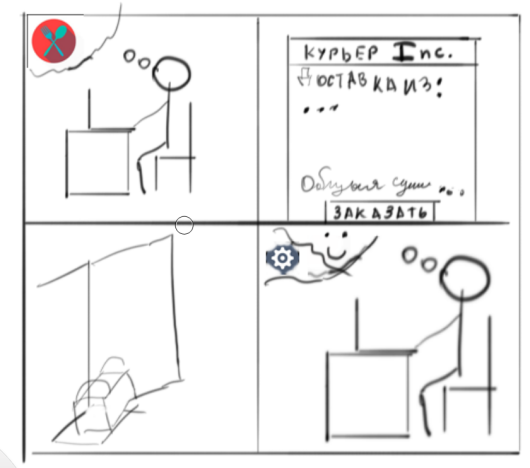
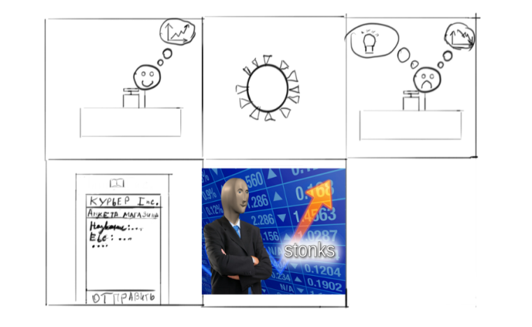

# Решение Носкова И.А.
## Описание проекта
В качестве выбранного проекта выступает автоматизация курьерской доставки из выбранных пользователя магазинов наиболеее актуальная при условиях пандемии и удаленной работы. Проект позволяет своим пользователям делать заказы из подключенных к системе доставки магазина различного профиля. А владельцам магазинов позволяет сэкономить время и деньги не создавая собственную систему доставки.

В качестве центральной идеи проекта, выбрана идея "изменения", так как идея проекта подразумевает формирование привычки удаленных заказов и доставки.
## Наблюдение
Для наблюдения были выбранны 3 человека:
* В качестве первого наблюдаемого выступает фроненд-разработчик Иван. Предприятие очень сознательно относится к здоровью своих сотруднико поэтому Иван, в связи с пандемией коронавируса был переведён на дистанционный режим работы. Так же сам Иван сознательно относится к своему здоровью, и в связи со своей боязнью болезни, или боязни заразить остальных людей. Поэтому Иван предпочитает дистанционный заказ продуктов и прочих вещей для осуществленния нормальной жизнедеятельности.

* Вторая наблюдаемая семидесятилетняя бабушка Елизавета Пеетровна, которую интернетом научили пользоваться внуки. Т.к. интернет в том числе позволяет Елизавете Петровне отслеживать актуальные новости, Елизавета Петровна ещё в начале распространения узнала про коронавирус. Так же, любимые внуки волнуются за бабаушку, и просят её не выходить лишний раз из дома, при этом Елизавета Петровна и до начала пандемии часто пользовалась средствами доставки. Но при всей вовлеченности Елизаветы Петровны в интернет, она предпочитает читать бумажные книги, вместо их цифровых экземпляров.

* Третим человеком попавшим под наблюдение стал Виталий. Виталий владелец местного магазина "Нон-стоп". В связи с введением режима массовой самоизоляции рпиток клиентов в магазин значительно уменьшился, и Виталий для того что бы не оказатся банкротом решил запустить службу курьерской доставки, так как это бы позволило достигнуть ему окупаемости. Однако это потребует слишком большого количества денег, которые он не может позволить себе потратить. Тогда как подключение к уже существующей сети доставок позволит сэкономить не только деньги но и время.
### Раскадровки (Рисунки выполнены в стиле сюрреализма)
Пользователь-заказчик

Пользователь-магазин

## Опрос

[href](https://forms.gle/V9sHD1HXJdyGZN8HA)

## Потребности

<ol>
<li> Отслеживание местоположения курьера</li>
<li> Отслеживание статуса заказа </li>
<li> Выбор необходимых условий для доставки заказа</li>
<li> Наличие гарантия доставки </li>
<li> Гарантия доставки </li>
<li> Выбор способа оплаты </li>
<li> Широкий каталог магазинов </li>
<li> Возможность подключения магазина к системе </li>
<li> Возможность заказа для другого контактного лица </li>
<li> Возможность диалога с курьером/магазином-поставщиком </li>
</ol>

